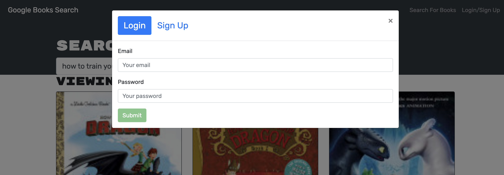
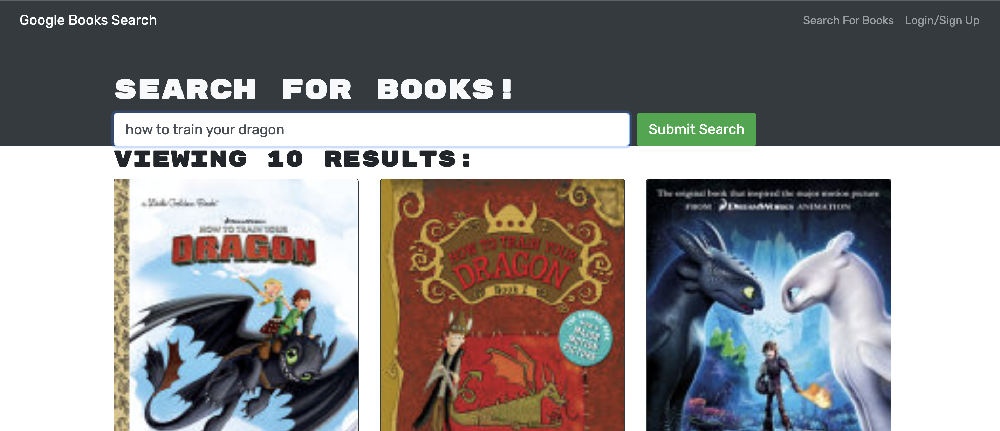
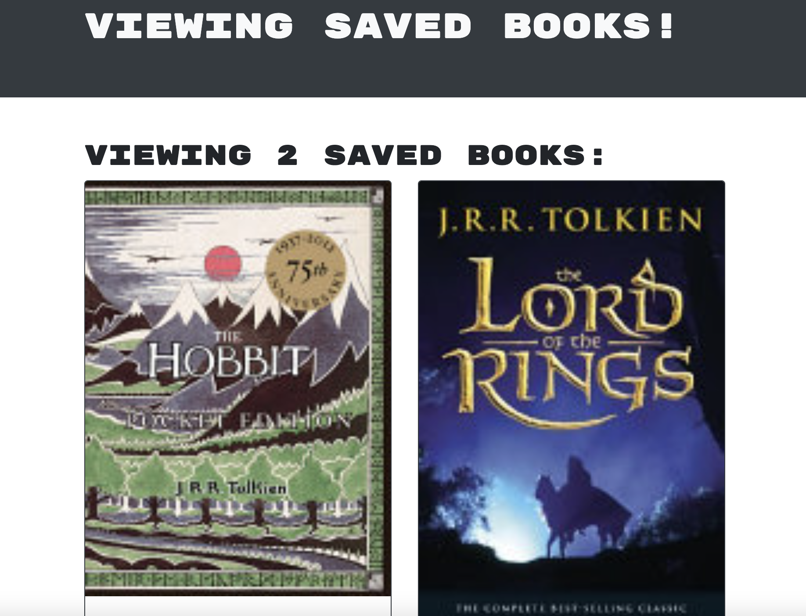

# Book Search Engine

## Description

This is a project that uses an Apollo Server that uses GraphQl queries and mutations to fetch and modify data! You can use the GoogleBooks API to search and find any books you may need and save them onto your profile!

## Table of Contents

- [Installation](#installation)
- [Usage](#usage)
- [License](#license)
- [Contributing](#contributing)
- [Tests](#tests)
- [Questions](#questions)

## Installation

To install necessary dependencies, run the following command:

```
  npm i
```

## Usage

Begin by installing dependencies. Then, use npm run build to build the project. You can run it by using npm run develop and it will open on your local browser at localhost:3000.

Here are some images of the application running:





A link to the deployed application can be found here: https://agile-ocean-88955.herokuapp.com/

## License

N/A

## Contributing

N/A

## Tests

To run tests, run the following command:

```
  N/A
```

## Questions

If you have any questions about the repo, open an issue or contact me directly at eduardogoto8@gmail.com. You can find more of my work at [eddygoto](https://github.com/eddygoto/).
